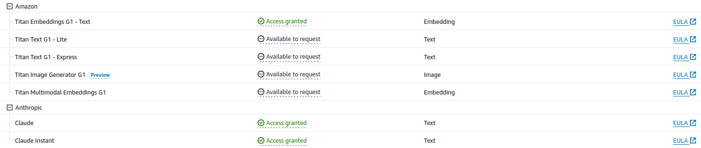

# Automation Framework

A concise manual on executing the automation script for deploying the complete UnicornPost project on AWS.

## Table of contents
Informations

- [Notes](#notes)
- [Deployment](#deployment)
## Notes

**NOTE:** 
- Prior to running the automation script, it is essential to have python3 installed on your system.
- The user is required to have _AdministratorAccess_ in their AWS account, and the terminal should be configured using the ```aws configure``` command with the _access_key_id_ and _secret_access_key_.
- In order for Amazon Personalize models to train properly, it is essential to have access to Amazon Titan Embeddings G1 - Text and Anthropic Claude, Claude Instant model in Amazon Bedrock.


**IMPORTANT NOTE:**
- It is necessary to modify the variable names for ```bucket_name```, ```backend_bucket_name```, and ```cognito_domain_name``` in ```values.yaml```. These names should be changed to reflect the unique S3 Bucket names and Cognito Domain name. Failure to do so may result in the rollback of the cloudformation stack.


## Deployment

To commence the implementation of this project, start the deployment procedure by executing the command provided below:

```
./automation.sh
```

Once the Amplify build is completed, the Amplify URL will be ready to serve.
