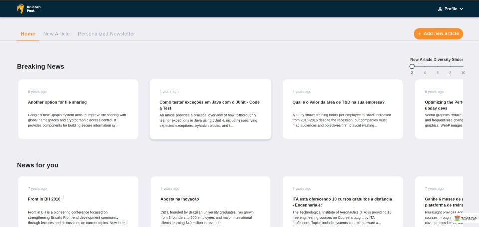
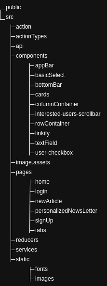

# Unicorn Post - News Recommendations using AWS
This project focuses on enhancing the front-page experience, article submission process, and personalized newsletters on a news platform. Leveraging ML models, the platform aims to deliver breaking news, personalized content recommendations, and curated newsletters, ensuring that users receive news that aligns with their interests. 




## Features
The project is structured into three main modules:
The Front-Page module, which handles breaking news and personalized news carousels.
The New Article module, responsible for processing and displaying user-submitted articles.
The Personalized Newsletter module, which facilitates the creation and distribution of customized newsletters.


## Local setup 
The Application is built on react framework which requires node to be installed:

```bash
sudo apt install nodejs
``` 

The project uses npm as a package manager, which can be installed as: 

```bash
sudo apt install npm
``` 
To run the project run the following commands:

```bash
npm install
``` 

```bash
npm start
```
Runs the app in the development mode.
Open [http://localhost:3000](http://localhost:3000) to view it in your browser.

The page will reload when you make changes.
You may also see any lint errors in the console.


## Project structure
consider the below project structure defining the directory structure of the project.



The project is divided into serveral directories which serve as the building blocks for the project. 

The **public** directory consists of files which are not compiled such as index.html and favicon.ico but should be present in the final built application.

The **src** directory serves as the react's app folder as it contains components, tests, css, static assest files etc. In this project src directory has the following sub-divisions

>**src/actions:** Different types of actions are stored in this folder. The action folder contains all the calling action creators. Actions are plain JavaScript objects that have a type field. Action can be considered as an event that describes something that happened in the application.

>**src/actionTypes:** This directory consists of files that describes an object of Redux action types that the resource reducer responds to. Dispatch these from action creators to change the state of the store.

>**src/api:** This directory consists of files which have functions through which calls to the backend apis are made. Various post and get apis are called through the files present in api directory.

>**src/components:** The components directory is futher sub-divided into various other directories which discribe the common UI componets such as App-Bar, Scroll-down menu, Cards, Text-fields, checkboxes etc. which are rendered in several pages in the project.

>**src/image.assets:** Comprises of static images which are used in other components.

>**src/pages:** This directory comprises of various pages which are rendered in the application such as login, sign-up, home, new-article etc.

>**src/reducers:** This directory contains the reducer files for various features such as authorization reducers, home reducers etc.. reducers are functions that take actions from the application, perform an action and return a new state based on the action passed into it.

>**src/services:** This directory contains all your code for interfacing with any external API. 

>**src/static:** This directory consists of all the static assets used in the project such as images and fonts.


## User Flow

### Login 
When the project is started the user is initially directed to the login page. If the user is already registered on the portal, the user may fill up the email and password fields and click on login button which will redirect the user to the home page upon successful login. The login page also offers the feature for forgot password clicking on which the user is provided with a popup, which leads to the forgot password flow. The user can also open the sign-up page by clicking on the sign up button at the bottom of the log in page.     

### Sign up
For a new user who wants to register to the portal, the user can use the sign up page by filling in the details in the fields provided on the page and click on the sign up button. The user is required to fill in his username, email and password in the respective fields and continue with the onboarding flow. Once The user clicks on the sign up button, a popup informs the user to verfy the account using the verification mail sent. Upon successful Verification the user is provided with a popup confirming the verification and signup.The user can also navigate to the log in page using the login button provided at the bottom of the page. 

### Home 
The home page is divided into three sub-Carousels: 
The first carousel provides the user with numerous card components which when clicked opens popups providing a detailed article.The cards generated in the Breaking news carousel can also be adjusted based on the diversity slider provides along with it.
The second carousel, which is named News for you provides the user with news articles curated specially based on user interests.    
The third carousel named genre of news provides the user which news articles but based on various genres such as Tech, AI, Cloud provider news etc., the user is supposed to select any genre of choice from the drop-down menu provided along with it which updates the genres of news accordingly. 

### New Article
The New article Tab lets the user create and submit articles.The tab provides the user with a text area which allows the user to create an article. Once the user provides a legitimate article and clicks on the submit button, he is provided with another carousel which comprises of sample list of interested users which relate to the article the user submitted. When the user selects any user from the sample list another menu opens providing the user with the list of the most recent articles viewed by the selected user. 

### Personalized newsletter 
The personalized newsletter tab provides the user with the ability to create personalized newsletters based on the selection of Gen Ai enabled checkbox.The page is divided into two major sections. The first section contains a prompt for gen ai and the sections following it provide the user with a personalized newsletter.The user is provided with a checkbox which enables or disables gen ai for the creation of the newsletter. If the user creates a personalized newsletter without gen ai enabled, he is provided with a newsletter which comprises of sections of news containing links which upon clicking opens news articles, with gen ai disabled creation the user is not provided with any links in the newsletter. 
